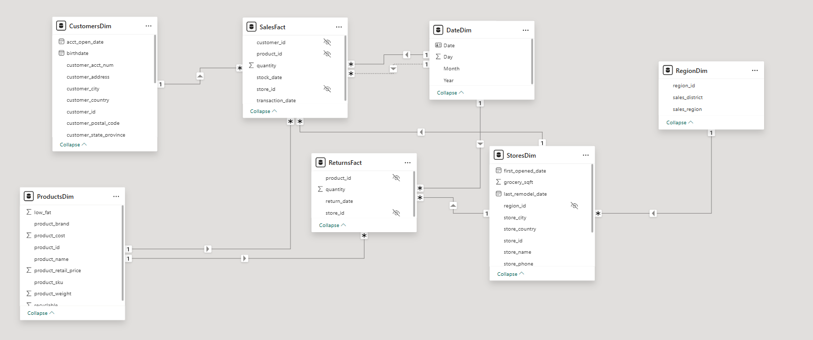

# 🛒 Retail Analytics Dashboard

### End-to-End Data Analysis Using SQL Server & Microsoft Power BI


---

# 📑 Table of Contents

- [Project Overview](#-project-overview)
- [Business Problem](#-business-problem)
- [Project Objectives](#-project-objectives)
- [Dataset Information](#-dataset-information)
- [Technologies Used](#-technologies-used)
- [Project Highlights](#-project-highlights)
- [Data Warehouse Design](#-data-warehouse-design)
- [Business Questions](#-business-questions)
- [SQL Implementation](#-sql-implementation)
- [SQL Views](#-sql-views)
- [Power BI Data Model](#-power-bi-data-model)
- [DAX Measures](#-dax-measures)
- [Dashboard Pages](#-dashboard-pages)
- [Key Performance Indicators](#-key-performance-indicators)
- [Business Insights](#-business-insights)
- [Business Recommendations](#-business-recommendations)
- [Repository Structure](#-repository-structure)
- [How to Run](#-how-to-run)
- [Deliverables](#-deliverables)
- [Author](#-author)

---

# 📌 Project Overview

This project is an **End-to-End Retail Data Analytics Solution** developed as the graduation project for the **Route Academy Data Analytics Diploma**.

The project transforms raw retail sales data into meaningful business insights by designing a SQL Server database, building a **Galaxy Schema**, performing business analysis using SQL, and creating interactive Power BI dashboards.

The solution follows the complete analytics lifecycle—from raw CSV files to business recommendations.

---

# 🎯 Business Problem

A retail company operating across **24 stores** in **USA, Canada, and Mexico** collects sales data from multiple systems over different years.

Decision makers lacked:

- A trusted data model
- Centralized reporting
- Clear KPIs
- Business insights
- Interactive dashboards

This project solves these problems through SQL Server and Power BI.

---

# 🎯 Project Objectives

- Design a SQL Server relational database.
- Build a Galaxy Schema.
- Import CSV datasets.
- Clean and prepare the data.
- Perform business analysis using SQL.
- Create SQL Views.
- Build an optimized Power BI semantic model.
- Create DAX measures.
- Design interactive dashboards.
- Generate business recommendations.

---

# 📊 Dataset Information

| Item | Value |
|------|------|
| Industry | Retail |
| Stores | 24 |
| Countries | USA, Canada, Mexico |
| Analysis Period | 1997–1998 |
| Sales Records | 270,000+ |
| Return Records | 8,000+ |

---

# 🛠 Technologies Used

- Microsoft SQL Server 2022
- SQL Server Management Studio (SSMS)
- T-SQL
- SQL Views
- Microsoft Power BI
- DAX
- Power Query
- CSV Files
- Git
- GitHub

---

# ⭐ Project Highlights

- End-to-End Data Analytics Project
- Galaxy Schema Design
- 2 Fact Tables
- 5 Dimension Tables
- 270K+ Sales Records
- 8K+ Return Records
- 11 Business Questions
- 6 SQL Views
- 30+ DAX Measures
- 5 Interactive Dashboard Pages
- Executive Business Insights
- Actionable Business Recommendations

---

# 🏗 Data Warehouse Design

The project follows a **Galaxy Schema** consisting of:

## Fact Tables

- SalesFact
- ReturnsFact

## Dimension Tables

- ProductsDim
- CustomersDim
- StoresDim
- RegionDim
- DateDim

> **Add your Galaxy Schema image here**

```markdown

```

---

# 📋 Business Questions

The project answers the following business questions:

1. Which stores and regions generated the highest revenue?
2. Which products generated the highest revenue?
3. Which products sold the highest quantities?
4. Which year generated the highest profit?
5. Which products have the highest return volume?
6. What is the total revenue lost due to returns?
7. What is the return rate by product, store, and region?
8. Are stores stocking products too early or too late?
9. Which store types are the most profitable?
10. Which customer segments spend the most?
11. Do larger stores generate proportionally more revenue?

---

# 💾 SQL Implementation

The SQL phase includes:

- Database Creation
- Table Creation
- Data Import
- Data Cleaning
- Primary Keys
- Foreign Keys
- Joins
- Aggregate Functions
- CASE Statements
- GROUP BY
- HAVING
- Common Table Expressions (CTEs)
- Window Functions
- Ranking Functions
- SQL Views
- Business Queries

---

# 🗂 SQL Views

| SQL View | Description |
|----------|-------------|
| vw_SalesPerformance | Sales, Revenue & Profit Analysis |
| vw_ReturnsAnalysis | Return Analysis |
| vw_ReturnRate | Return Rate Calculations |
| vw_StockingBehavior | Inventory Stock Lag Analysis |
| vw_CustomerSegments | Customer Spending Analysis |
| vw_StoreEfficiency | Store Performance Analysis |

---

# 📈 Power BI Data Model

The Power BI report uses a **Galaxy Schema**.

Relationships include:

- SalesFact → ProductsDim
- SalesFact → CustomersDim
- SalesFact → StoresDim
- ReturnsFact → ProductsDim
- ReturnsFact → StoresDim
- StoresDim → RegionDim
- DateDim connected through Active and Inactive Relationships

The model uses **USERELATIONSHIP()** for return calculations and **Time Intelligence**.

---

# 📐 DAX Measures

More than **30 DAX measures** were created, including:

- Total Sales
- Total Orders
- Average Order Value
- Units Sold
- Gross Profit
- Gross Margin %
- Total Returns
- Revenue Lost
- Net Revenue
- Return Rate %
- Year-over-Year Growth
- Month-over-Month Growth

---

# 📊 Dashboard Pages

## 🏠 Home

- Dashboard Navigation
- Project Overview
- Quick Access Buttons

---

## 📈 Executive Overview

- Total Sales
- Net Revenue
- Gross Profit
- Gross Margin %
- Total Orders
- Revenue Trend
- Revenue by Country
- Year-over-Year Growth

---

## 🛒 Sales & Products

- Best Selling Products
- Top 10 Products
- Revenue by Store Type
- Gross Profit by Store Type
- Units Sold
- Average Stock Lag

---

## 👥 Customers & Regional Insights

- Revenue by Income
- Revenue by Occupation
- Revenue by Gender
- Revenue by Region
- Member Card Analysis
- Top Customers

---

## 🔄 Returns Analysis

- Total Returns
- Revenue Lost
- Return Rate
- Monthly Return Trend
- Return Rate by Store
- Top Returned Products

---

# 📊 Key Performance Indicators

| KPI | Value |
|------|------|
| Total Sales | $1.76M |
| Net Revenue | $1.75M |
| Gross Profit | $1.05M |
| Gross Margin | 59.67% |
| Total Orders | 270K |
| Units Sold | 833K |
| Total Returns | 8K |
| Return Rate | 0.99% |

---

# 💡 Business Insights

## 📈 Sales Growth

- Revenue reached **$1.76M**.
- Sales increased by **210%** from 1997 to 1998.
- USA generated approximately **56%** of total revenue.
- Deluxe Supermarkets delivered the highest profit.

### 🛒 Product Performance

- Hermanos Green Pepper was the best-selling product.
- Deluxe Supermarkets generated the largest profit share.
- Product performance remained competitive across both years.

### 👥 Customer Insights

- Golden Member customers generated over **55%** of total revenue.
- Middle-income customers were the highest spending segment.
- Professional occupations generated the highest revenue.
- Male and Female spending was nearly identical.

### 🔄 Returns Analysis

- Return Rate remained below **1%**.
- Revenue Lost totaled approximately **$17.43K**.
- Seasonal peaks occurred in November and December.
- Returns stayed well below the common 5% retail benchmark.

---

# 📌 Business Recommendations

Based on the analysis, management should focus on:

- Expanding Deluxe Supermarket locations.
- Investing further in the Golden Member loyalty program.
- Improving Canada's market performance.
- Reviewing high-return products such as Hermanos Green Pepper.
- Continuing to monitor inventory stock lag.

---

# 📂 Repository Structure

```
Retail-Analytics-Dashboard
│
├── Dataset
│   ├── CSV Files
│
├── SQL
│   ├── Database.sql
│   ├── Tables.sql
│   ├── Insert_Data.sql
│   ├── SQL_Views.sql
│   ├── Business_Queries.sql
│
├── SQL Backup
│   └── RetailAnalytics.bak
│
├── Power BI
│   └── Retail Analytics Dashboard.pbix
│
├── Presentation
│   └── RetailAnalytics_Graduation_Project.pptx
│
├── images
│   └── galaxy-schema.png
│
└── README.md
```

---

# 🚀 How to Run

## 1. Clone the repository

```bash
git clone https://github.com/your-username/Retail-Analytics-Dashboard.git
```

## 2. Open SQL Server Management Studio

Execute the SQL scripts in the following order:

1. Database.sql
2. Tables.sql
3. Insert_Data.sql
4. SQL_Views.sql
5. Business_Queries.sql

## 3. Open Power BI Desktop

Open:

```
Retail Analytics Dashboard.pbix
```

## 4. Refresh the Data

Connect Power BI to SQL Server and refresh the report.

---

# 📁 Deliverables

This repository contains:

- ✅ SQL Server Database
- ✅ SQL Scripts
- ✅ SQL Views
- ✅ Business Queries
- ✅ Power BI Dashboard (.pbix)
- ✅ PowerPoint Presentation (.pptx)
- ✅ SQL Backup (.bak)
- ✅ Documentation
- ✅ README

---

# 👩‍💻 Author

**Sandy Emad**

Computer Science & Artificial Intelligence Student

**Skills**

- SQL Server
- Power BI
- DAX
- T-SQL
- Data Modeling
- Data Visualization
- Business Intelligence

📧 Feel free to connect with me on LinkedIn and GitHub.

---

# 🙏 Acknowledgements

This project was completed as the Graduation Project for the **Route Academy Data Analytics Diploma**. It demonstrates practical skills in SQL Server, Power BI, DAX, data modeling, and business intelligence by transforming raw retail data into actionable insights for decision-makers.
